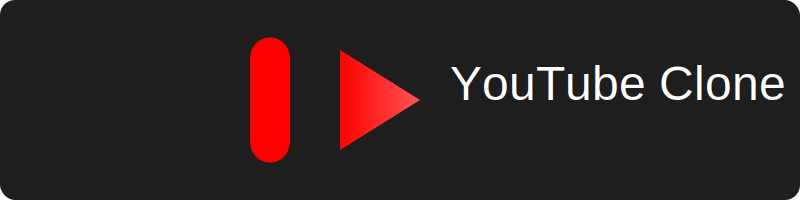

# YouTube Clone

  

A responsive YouTube clone that works on any device. This application allows you to browse and play videos from your local collection.

## Features

  

- ✨ Responsive design that adapts to any screen size (mobile, tablet, desktop)
- 🎬 Video playback with custom controls and fullscreen support
- 🎯 Categorized video browsing with smart filtering
- 🔍 Powerful search functionality
- 💬 Video details and comments display
- 🔄 Dynamic loading of videos from JSON file
- 🌙 Toggle between light and dark mode
- 🎞️ Automatic thumbnail generation from videos
- 📺 Video preview on hover
- 🕒 "Watch Later" playlist functionality

## Usage

  

1. Simply open `index.html` in your web browser to launch the application
2. Browse videos by scrolling through the video cards
3. Click on any video to play it in the modal player
4. Use the category buttons at the top to filter videos by category
5. Click the menu icon to toggle the sidebar
6. Click the video title to edit it (changes are saved automatically)
7. Use the "Watch Later" button to save videos for later viewing

## Video Management

The application loads videos from the `videos.json` file, which contains metadata about each video. The actual video files should be placed in the same directory as the application.

To add new videos:
1. Place the video file in the same directory
2. Add an entry to the `videos.json` file with the appropriate metadata
3. Optionally, add a thumbnail image in the `thumbnails` directory

## Responsive Design

  

The application is designed to work on all devices:
- 📱 On mobile devices, the sidebar is hidden by default and can be toggled
- 📱💻 On tablets, the video grid adjusts to show fewer columns
- 💻 On desktops, the full interface is displayed with a persistent sidebar

## Dark Mode Support

  

Toggle between light and dark mode with a single click! The application remembers your preference for future visits.

## Technology Used

- HTML5
- CSS3 (with Flexbox and Grid layout)
- Vanilla JavaScript (ES6+)
- FontAwesome icons
- LocalStorage API for saving user preferences

## Customization

You can customize the application by:
- Modifying the CSS in `styles.css` to change the look and feel
- Editing the categories in `index.html` to match your video collection
- Updating the video loading logic in `script.js` to add new features

## License

This project is for personal use only. All trademarks and copyrights belong to their respective owners.

---

  
   
  Created with ❤️ by <b>Priyanshu Chaurasiya</b> - April 2025

